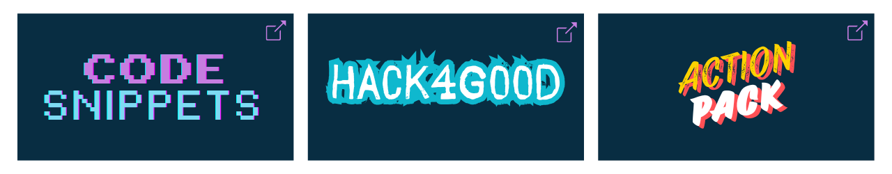

```This file is automatically generated and should not be edited by contributors.```

# 🎃 Hacktoberfest 2025 is Live! 🎃



<map name="hacktoberfest-projects">
  <area shape="rect" coords="0,0,426,250" href="https://github.com/ServiceNowDevProgram/code-snippets" alt="Visit the Code Snippets repository">
  <area shape="rect" coords="427,0,852,250" href="https://github.com/ServiceNowDevProgram/Hack4Good-Idea-Submission" alt="Visit the Hack4Good repository">
  <area shape="rect" coords="853,0,1280,250" href="https://github.com/ServiceNowDevProgram/ActionPack" alt="Visit the ActionPack repository">
</map>
<br>

Welcome to ServiceNow's Hacktoberfest community repository, managed by the Developer Program and SNDevs community.

Hacktoberfest 2025 is officially underway! Jump into the projects below, connect with the crew, and start collecting contributions today.

- A blog post about this year's participation, along with some history and background, and what's in it for participants can be found here: https://devlink.sn/hacktoberfest

🔔🔔🔔<br>
***CONTRIBUTORS must follow all guidelines in the various CONTRIBUTING.md files of each repository*** or run the risk of having your Pull Requests labeled as spam. This repository's CONTRIBUTING.md file can be found [here](/CONTRIBUTING.md).<br>
🔔🔔🔔

## Need help with anything ServiceNow+Hacktoberfest?

Every reviewer/maintainer hangs out on the SNDevs Slack workspace. You can join via this link (https://invite.sndevs.com/) and then find us on the [#hacktoberfest channel](https://sndevs.slack.com/archives/C01C0RWV32M).

<!-- TOC -->
## Quick navigation

- [How to contribute](#contribute)
- [Projects](#projects)
- [Scoring](#points)
- [Your Hacktoberfest crew](#reviewers)
- [Leaderboard](#leaders)

<!-- /TOC -->

# <br><a name="contribute" href="#contribute"></a>

You can contribute by following these steps:

1. Select a project from our list below that interests you
2. Create a fork of that project's repository (you get a point just by forking!)
3. Create a new branch on your fork
4. Add/Update the repo
5. Submit a pull request!

That's it! More detailed contribution instructions will be available on each project's "CONTRIBUTING.md" file. **Always read a repo's README and CONTRIBUTING files before you participate in a project!**

# <br><a name="projects" href="#projects"></a>

Dive into the projects below to finish your Hacktoberfest goal:

- You must make six approved pull-requests between October 1 and October 31.
- These six pull-requests can be spread out across multiple projects or can all be for one project.

To finish your _ServiceNow_ Hacktoberfest goals (as mentioned on the blog post linked above):

- In addition to the above goals, also post a comment on the blog post detailing your contributions.

## 2025 project lineup

### Level 1: Start your open-source, collaborative journey here.

New to open source or Git? Return to our Code Snippets project and contribute without spinning up an instance, perfect for your first pull request. Jump in at [ServiceNowDevProgram/code-snippets](https://github.com/ServiceNowDevProgram/code-snippets).

### Level 2: Understand open source in ServiceNow.

Connect a ServiceNow instance to Git and submit records to the Hack4Good Ideation Portal. You'll practice source control inside the platform while fueling future social-impact projects with Hack4Good. Contribute at [ServiceNowDevProgram/Hack4Good-Idea-Submission](https://github.com/ServiceNowDevProgram/Hack4Good-Idea-Submission).

### Level 3: Contribute to our cornerstone project.

Help build ActionPack, a utility that the entire ServiceNow community can benefit from. Advanced contributors can shape the roadmap and keep the enhancements flowing. Start building at [ServiceNowDevProgram/ActionPack](https://github.com/ServiceNowDevProgram/ActionPack).

## Have a ServiceNow app you want to open to collaboration?

Reach out to Earl Duque, László Balla, or Astrid Sapphire and we'll get your repo officially hosted.

# <br><a name="points" href="#points"></a>

There are a few ways to earn points here. The moment you earn a point, this file is automatically updated.

Ways for everyone to earn points:

- Forking a repo = 1 point
- Submitting a pull request = 5 points
- Submitting an issue = 2 points

Ways for sndevs designated approvers to earn points:

- Approving and merging a pull request = 1 point
- Closing an issue = 1 point
- Closing a pull request without merging = 1 point

To participate in moderation, join the sndevs at https://sndevs.com/ and join the #hacktoberfest channel.

# <br><a name="reviewers" href="#reviewers"></a>

Meet the volunteer team who will be maintaining the Hacktoberfest projects:

| Avatar | Name | GitHub |
| --- | --- | --- |
|  | Abhishek Pandey | [@bird-03](https://github.com/bird-03) |
|  | Adam Celli | [@wiz0floyd](https://github.com/wiz0floyd) |
|  | Ajay Kumar | [@techTrekwithAJ](https://github.com/techTrekwithAJ) |
|  | Astrid Saphire | [@SapphicFire](https://github.com/SapphicFire) |
|  | Carlos Camacho | [@kmxo](https://github.com/kmxo) |
| %20Small.png) | Chris Helming | [@chelming](https://github.com/chelming) |
|  | Dr. Atul Grover | N/A |
|  | Earl Duque | [@earlduque](https://github.com/earlduque) |
|  | Ivan Betev | [@ivan-betev](https://github.com/ivan-betev) |
|  | László Balla | [@Lacah](https://github.com/Lacah) |
|  | Maik Skoddow | [@mskoddow](https://github.com/mskoddow) |
|  | MGOPW | [@MGOPW](https://github.com/MGOPW) |
|  | Mohit Kaushik | [@kmohit2809](https://github.com/kmohit2809) |
|  | Nia McCash | [@niamccash](https://github.com/niamccash) |
|  | Paige Duffey | [@404paige](https://github.com/404paige) |
|  | Paul Pradap Chandru | [@Paulsylo25](https://github.com/Paulsylo25) |
|  | Rampriya Sundaramoorthy | [@Rampriya-S](https://github.com/Rampriya-S) |
|  | Ravi Chandra | [@ravichandra1998g](https://github.com/ravichandra1998g) |
|  | Rohila Voona | [@rohi-v](https://github.com/rohi-v) |
|  | Sachin Namjoshi | [@snamjosh](https://github.com/snamjosh) |
|  | Sandeep Dutta | [@sandeepd26](https://github.com/sandeepd26) |
|  | Shakeel Shaik | [@am-shakeel](https://github.com/am-shakeel) |
|  | Shreya Wani | [@shreyawani98](https://github.com/shreyawani98) |
|  | Tosin Dada | [@ToosinDada](https://github.com/ToosinDada) |
|  | Willem Zeiler | [@WillemZeiler](https://github.com/WillemZeiler) |

# <br><a name="leaders" href="#leaders"></a>
